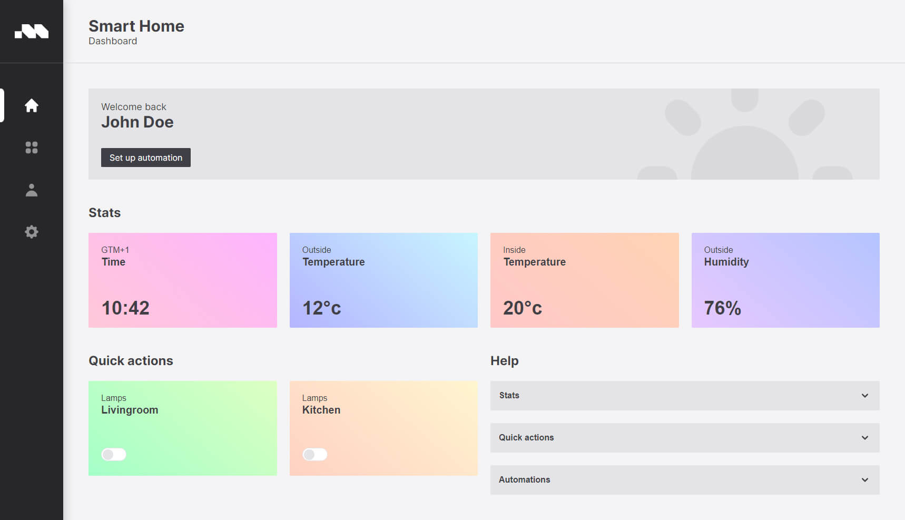

# Minze Demo

Demo of a fictive Smart Home dashboard application.



[Article on Codrops](https://tympanus.net/codrops/?p=58877)

[Demo](http://tympanus.net/Development/.../)

## Running

The application only needs a webserver to run.

Install dependencies:

```
npm install
```

Start a local server:

```
npm serve
```

## Credits

- Inter font from [Google Fonts](https://fonts.google.com/share?selection.family=Inter:wght@400;700)

## Misc

Follow *Author*: [GitHub](https://github.com/sergejcodes)

Follow Codrops: [Twitter](http://www.twitter.com/codrops), [Facebook](http://www.facebook.com/codrops), [GitHub](https://github.com/codrops), [Instagram](https://www.instagram.com/codropsss/)

## License
[MIT](LICENSE)